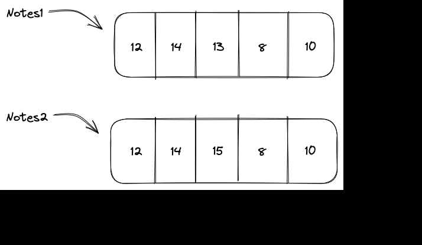

<p style="text-align:left;">
    [Séance 4 - Structures Iteratives et communications avec Excel](s4-vba-2.md)
    <span style="float:right;">
        [Séance 6 - VBA: Eléments visuels](s6-vba-4.md)
    </span>
</p>
<div style="text-align:center;">

# Séance 5 - Tableaux et Enregistrements

</div>

---

## Avant de commencer

<div class="line"></div>

Imaginons que dans un programme, nous avons besoin d’un grand nombre de variables,
il devient difficile de donner un nom à chaque variable.

<div class="exemple">

Si l'on souhaite écrire un algorithme permettant de saisir cinq notes et de les afficher après avoir multiplié toutes les notes par trois, on pourrait écrire :

```vb
Dim note1 As Integer
Dim note2 As Integer
Dim note3 As Integer
Dim note4 As Integer
Dim note5 As Integer

note1 = InputBox("Saisir la note 1")
note2 = InputBox("Saisir la note 2")
note3 = InputBox("Saisir la note 3")
note4 = InputBox("Saisir la note 4")
note5 = InputBox("Saisir la note 5")

note1 = note1 * 3
note2 = note2 * 3
note3 = note3 * 3
note4 = note4 * 3
note5 = note5 * 3

MsgBox note1
MsgBox note2
MsgBox note3
MsgBox note4
MsgBox note5
```

</div>

<div class="line"></div>

Dans notre cas, il est possible d'écrire la fonction parceque l'on ne souhaitait que saisir et afficher cinq notes. Mais si l'on souhaitait en saisir 100, comment ferions-nous ?

Comme les variables ont des noms différents, on ne peut **pas utiliser de boucle**, ce qui allonge considérablement le code et le rend très répétitif.

Pour résoudre ce problème, il existe un type de données qui permet de définir plusieurs variables de même type : **les tableaux**.

---

## Les tableaux

Un **tableau** est une suite d’éléments de même type. Il utilise plusieurs cases mémoire à l’aide d’un seul nom.

Comme toutes les cases portent le même nom, elles se différencient par un **numéro** ou un **indice**.

Nous pouvons représenter schématiquement un tableau **Notes** composé de cinq cases:


Ainsi dans cette exemple, si l'on souhaite accéder à la note **13**, on appelera **Notes[3]** (puisque 13 est à la troisième case de notre tableau).


---

### Déclaration d'un tableau

Pour déclarer un tableau, on utilise la syntaxe suivante :

```vb
Dim tableau(n) As type
```

où **n** est le nombre d'éléments du tableau et **type** est le type des éléments du tableau.

<div class="exemple">
Pour déclarer un tableau **notes** de 5 entiers, on écrit :

```vb
Dim notes(5) As Integer
```

</div>

Si l'on souhaite donner un intervalle de valeurs à un tableau, on utilise la syntaxe suivante :

```vb
Dim tableau(a To b) As type
```

où **a** et **b** sont les bornes de l'intervalle.

<div class="exemple">

Pour déclarer un tableau **notes** d'entiers allant de 5 à 10, on écrit :

```vb
Dim notes(5 To 10) As Integer
```

</div>

Pour remplir les éléments d'un tableau, on utilise la syntaxe suivante :

```vb
tableau(i) = valeur
```

où **i** est l'indice de l'élément à remplir et **valeur** est la valeur à affecter à l'élément.

<div class="exemple">

Pour remplir le tableau **notes** avec 3 notes qui sont 10, 12, 14, on écrit :

```vb
Dim notes(1 To 3) As Integer
notes(1) = 10
notes(2) = 12
notes(3) = 14
```

</div>

---

### Tableaux dynamiques


Si l'on ne précise pas la taille du tableau au moment de la déclaration,
le tableau est appelé **dynamique**.

Les tableaux dynamiques sont utilisés lors l'on ne connait pas à l'avance le nombre d'éléments qu'il va falloir stocker.

Pour déclarer un tableau dynamique, on utilise la syntaxe suivante :

```vb
Dim tableau() As type
```

C'est la même syntaxe que pour les tableaux statiques, sauf qu'on ne précise pas la taille du tableau.

---

### Algorithmes sur les tableaux

#### Notes importantes

Ces **algorithmes** sont donnés pour vous aider à comprendre comment fonctionnent les tableaux.

**Vous n'êtes pas obligés de les connaître par coeur.**

Ils pourront cependant vous êtes **utiles** lors des différents exercices que vous aurez à faire.

<div class="line"></div>

#### Comparaison de deux tableaux

L'idée de l'agorithme est la suivante :

On vérifie d'abord que les deux tableaux ont la même taille.

1. Si ce n'est pas le cas, on affiche **les tableaux sont différents** et on sort de la procédure.
2. Sinon, on parcourt les deux tableaux et on compare les éléments.
    1. Si on trouve un élément différent, on affiche **les tableaux sont différents** et on sort de la procédure.
    2. Si on arrive au bout des deux tableaux sans avoir trouvé d'élément différent, on affiche **les tableaux sont identiques**.



L'algorithme peut être écrit en VBA de la manière suivante :

<details>

```vb
Dim tableau1() As Integer
Dim tableau2() As Integer

If UBound(tableau1) = UBound(tableau2) Then
    For i = 0 To UBound(tableau1)
        If tableau1(i) <> tableau2(i) Then
            MsgBox "Les tableaux sont différents"
            Exit Sub
        End If
    Next i
    MsgBox "Les tableaux sont identiques"
Else
    MsgBox "Les tableaux sont différents"
End If
```

</details>

---

#### Recherche d'un élément dans un tableau

On souhaite écrire un algorithme qui permet de **rechercher un élément** dans un tableau.

Pour cela, on parcourt le tableau et on compare l'élément courant avec l'élément recherché.

Si on trouve l'élément recherché, on affiche l'indice de l'élément et on sort de la procédure.

Si on arrive au bout du tableau sans avoir trouvé l'élément recherché, on affiche un message d'erreur.


<div class = "exercice">


```vb
Dim tableau() As Integer
Dim element As Integer

For i = 0 To UBound(tableau)
    If tableau(i) = element Then
        MsgBox "L'élément " & element & " est à l'indice " & i
        Exit Sub
    End If
Next i
MsgBox "L'élément " & element & " n'est pas dans le tableau"
```

</div>


---

#### Ajout d'un élément dans un tableau

##### A la fin du tableau

On souhaite écrire un algorithme qui permet d'ajouter un élément dans un tableau à la fin du tableau. Pour cela, on crée un nouveau tableau de taille **n + 1** et on copie les éléments du tableau initial dans le nouveau tableau. Enfin, on insère l'élément à la fin du tableau.

<div class="exercice">

```vb
Dim tableau() As Integer
Dim element As Integer

ReDim tableau(UBound(tableau) + 1)
tableau(UBound(tableau)) = element
```

</div>


<div class="line"></div>

##### A une position p

On souhaite écrire un algorithme qui permet d'ajouter un élément dans un tableau à une position donnée. 

Pour cela, on crée un nouveau tableau de taille **n + 1** et on copie les éléments du tableau initial dans le nouveau tableau.

Ensuite, on décale les éléments du tableau initial à partir de la position **p** vers la droite.

Enfin, on insère l'élément à la position **p**.

<div class="exercice">

```vb
Dim tableau() As Integer
Dim element As Integer
Dim position As Integer

ReDim tableau(UBound(tableau) + 1)

For i = UBound(tableau) To position Step -1
    tableau(i) = tableau(i - 1)
Next i

tableau(position) = element
```

</div>

---

#### Suppression d'un élément dans un tableau

##### La position de l'élement à supprimer est connue

On souhaite écrire un algorithme qui permet de supprimer un élément dans un tableau à une position donnée.

Pour cela, on décale les éléments du tableau à partir de la position **p** vers la gauche.

Enfin, on crée un nouveau tableau de taille **n - 1** et on copie les éléments du tableau initial dans le nouveau tableau.

<div class="exemple">

```vb
Dim tableau() As Integer
Dim position As Integer

For i = position To UBound(tableau) - 1
    tableau(i) = tableau(i + 1)
Next i

ReDim tableau(UBound(tableau) - 1)
```

</div>

<div class="line"></div>

##### La position de l'élement à supprimer n'est pas connue

On souhaite écrire un algorithme qui permet de supprimer un élément dans un tableau mais sans connaitre sa position.

Pour cela, on parcourt le tableau et on compare l'élément courant avec l'élément à supprimer.

Si on trouve l'élément à supprimer, on décale les éléments du tableau à partir de la position **p** vers la gauche.

Enfin, on crée un nouveau tableau de taille **n - 1** et on copie les éléments du tableau initial dans le nouveau tableau.


<div class="exemple">

```vb

Dim tableau() As Integer
Dim element As Integer

For i = 0 To UBound(tableau)
    If tableau(i) = element Then
        For j = i To UBound(tableau) - 1
            tableau(j) = tableau(j + 1)
        Next j
        ReDim tableau(UBound(tableau) - 1)
        Exit Sub
    End If
Next i
```

</div>

---

#### Tri d'un tableau

##### Tri par sélection

Le **tri par sélection** consiste à parcourir le tableau et à échanger l'élément courant avec le plus petit élément du tableau.

On répète cette opération jusqu'à ce que le tableau soit trié.


<div class="exemple">

```vb
Dim tableau() As Integer

For i = 0 To UBound(tableau) - 1
    Dim min As Integer
    min = i
    For j = i + 1 To UBound(tableau)
        If tableau(j) < tableau(min) Then
            min = j
        End If
    Next j
    Dim temp As Integer
    temp = tableau(i)
    tableau(i) = tableau(min)
    tableau(min) = temp
Next i
```

</div>

<div class="line"></div>

##### Tri par insertion

Le tri par insertion consiste à parcourir le tableau et à insérer l'élément courant dans la partie triée du tableau. On répète cette opération jusqu'à ce que le tableau soit trié.

Pour plus d'informations, lire la page wikipédia sur [le tri par insertion](https://fr.wikipedia.org/wiki/Tri_par_insertion).

<div class="exemple">

```vb

Dim tableau() As Integer

For i = 1 To UBound(tableau)
    Dim temp As Integer
    temp = tableau(i)
    Dim j As Integer
    j = i - 1
    While j >= 0 And tableau(j) > temp
        tableau(j + 1) = tableau(j)
        j = j - 1
    Wend
    tableau(j + 1) = temp
Next i
```

</div>

---

## Les enregitrements

Un **enregistrement** est un type de données qui permet de regrouper plusieurs variables de types différents.

On peut déclarer un enregistrement de la manière suivante :

```vb
Type Enregistrement
    Champ1 As type1
    Champ2 As type2
    Champ3 As type3
End Type
```

avec **Enregistrement** le nom de l'enregistrement, **Champ1**, **Champ2** et **Champ3** les noms des champs de l'enregistrement et **type1**, **type2** et **type3** les types des champs de l'enregistrement.

<div class="exemple">

Si l'on souhaite déclarer un enregistrement **Personne** qui contient un nom, un prénom et un âge, on peut écrire :

```vb
Type Personne
    Nom As String
    Prenom As String
    Age As Integer
End Type
```

</div>

On peut ensuite déclarer une variable de type **Personne** :

```vb
Dim personne As Personne
```

On peut ensuite accéder aux champs de l'enregistrement :

```vb
personne.Nom = "Dupont"
personne.Prenom = "Jean"
personne.Age = 25
```

### Tableau d'enregistrements

Il est possible de déclarer un tableau d'enregistrements (ici de *Personne*) de la manière suivante :

```vb
Dim tableau() As Personne
```

Dans ce cas là, il est possible d'accéder aux champs de l'enregistrement de la manière suivante :

<div class="exemple">

```vb
tableau(0).Nom = "Dupont"
tableau(0).Prenom = "Jean"
tableau(0).Age = 25
```

</div>

---

### Instruction **With**

L'instruction **With** permet d'accéder aux champs d'un enregistrement de manière plus concise.

Par exemple, si l'on souhaite accéder au champ **Nom** de l'enregistrement **personne**, on peut écrire :

<div class="exemple">

```vb
With personne
    .Nom = "Dupont"
End With
```

</div>

Si l'on souhaite accéder au champ **Nom** de l'enregistrement **tableau(0)**, on peut écrire :

<div class="exemple">

```vb
With tableau(0)
    .Nom = "Dupont"
End With
```

</div>