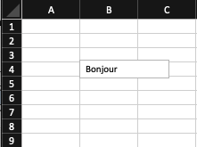

<p style="text-align:left;">
    [Séance 5 - Tableaux et Enregistrements](s5-vba-3.md)
    <span style="float:right;">
        [Retour au sommaire](../README.md)
    </span>
</p>

<div style="text-align:center;">

# Séance 6 - VBA: Eléments visuels

</div>

---

## Les contrôles

Les **contrôles** sont des objets d'interaction grâce auxquels l'utilisateur construit un dialogue.

Ces dialogues se font par l'intermédiaire d'affichage et/ou saisie de données.

Comme pour les feuilles, des propriétés et des événements sont associés aux contrôles.

#### Rappel des affichages et saisies de données

Voir la section <a href="s3-vba-1.html#-les-fenetres-predefinies" target="_blank"> Les fenêtres prédéfinies</a> de la séance 3.

### Les contrôles de base

Les contrôles de base sont les éléments visuels les plus simples. Ils peuvent être de la forme suivante :

- [Zone de texte](#-zone-de-texte)
- [Bouton](#-bouton)
- [Case à cocher](#-case-a-cocher)
- [Liste à choix multiple](#-liste-a-choix-multiple)
- [Liste déroulante](#-liste-deroulante)

#### Zone de texte <a name="-zone-de-texte"></a>

La **zone de texte** (appelée *TextBox* en **VBA**) permet de saisir une information.

##### Propriétés

- **Text** : permet de récupérer ou de modifier le texte de la zone de texte.
- **Font** : permet de récupérer ou de modifier la police de caractères de la zone de texte.
- **Font.Size** : permet de récupérer ou de modifier la taille de la police de caractères de la zone de texte.

La zone de texte peut être créée à l'aide de la méthode **Add** .

On peut définir la taille de la zone de texte en utilisant les paramètres **Width** et **Height**.

<div class="exemple">

```vb
Sub exemple_zoneTexte()
    'Déclaration de la zone de texte'
    Dim zone As TextBox
    'Création de la zone de texte'
    Set zone = ActiveSheet.TextBoxes.Add(Width:=100, Height:=20)
    'Modification du texte de la zone de texte'
    zone.Text = "Bonjour" 
End Sub
```

Lors de l'exécution de la macro, la zone de texte ci-dessous apparaît dans la feuille active.

<div style="text-align:center;">

</div>

</div>

#### Bouton <a name="-bouton"></a>

Le **bouton** (de la classe *Button* en **VBA`) permet d'exécuter une action.

##### Propriétés

- **Name** : permet de récupérer ou de modifier le nom du bouton.
- **Caption** : permet de récupérer ou de modifier le texte du bouton.
- **Enabled** : permet de récupérer ou de modifier l'état du bouton. Si la valeur est *True*, le bouton est actif. Si la valeur est *False*, le bouton est désactivé.

<div class="exemple">

```vb
Sub exemple_bouton()
    'Déclaration du bouton'
    Dim bouton As Button
    'Création du bouton' 
    Set bouton = ActiveSheet.Buttons.Add(Left:=100, Top:=100, Width:=100, Height:=20) 
    'Modification du texte du bouton'
    bouton.Caption = "Cliquez ici"
End Sub
```

</div>

#### Case à cocher <a name="-case-a-cocher"></a>

Les cases à cocher (**CheckBox** En **VBA`) permettent à l'utilisateur de sélectionner une ou plusieurs options dans une liste.

Les cases à cocher ne peuvent retourner que deux valeurs :

- cochée (*True*)
- non cochée (*False*)

À chaque clic de l’utilisateur, le contrôle passe de l’état coché à l’état non coché, et inversement.

##### Propriétés

Les principales propriétés du contrôle CheckBox sont :

- **Name** : permet de récupérer ou de modifier le nom de la case à cocher.
- **Caption** : permet de récupérer la valeur de l’intitulé dans la boîte de dialogue.
- **Value** : permet de récupérer l’indication cochée (True) ou non cochée (False).
- **Visible** : permet d'afficher ou non l'objet dans la boîte de dialogue.
- **Enabled** : permet de rendre l'objet accessible (True) ou non (False).


<div class="exemple">

```vb

Sub exemple_caseACocher()
    'Déclaration de la case à cocher'
    Dim caseACocher As CheckBox
    'Création de la case à cocher'
    Set caseACocher = ActiveSheet.CheckBoxes.Add(Left:=100, Top:=100, Width:=100, Height:=20)
    'Modification du texte de la case à cocher'
    caseACocher.Caption = "Cocher"
    'Modification de l'état de la case à cocher'
    caseACocher.Value = True
End Sub
```

</div>

#### Liste à choix multiple <a name="-liste-a-choix-multiple"></a>

La **liste à choix multiple** (de la classe *ListBox* en **VBA** ) permet à l'utilisateur de sélectionner une ou **plusieurs** options dans une liste.

##### Propriétés

- **Name** : permet de récupérer ou de modifier le nom de la liste à choix multiple.
- **List** : permet de récupérer ou de modifier la liste des options de la liste à choix multiple.
- **Value** : permet de récupérer ou de modifier la valeur de l'option sélectionnée dans la liste à choix multiple.

<div class="exemple">

```vb

Sub exemple_listeChoixMultiple()
    'Déclaration de la liste à choix multiple'
    Dim liste As ListBox
    'Création de la liste à choix multiple'
    Set liste = ActiveSheet.ListBoxes.Add(Left:=100, Top:=100, Width:=100, Height:=20)
    'Modification de la liste des options de la liste à choix multiple'
    liste.List = Array("Option 1", "Option 2", "Option 3")
    'Modification de la valeur de l'option sélectionnée dans la liste à choix multiple'
    liste.Value = "Option 2" 
End Sub
```

</div>

#### Liste déroulante <a name="-liste-deroulante"></a>

La **liste déroulante** (de la classe *DropDown* en **VBA`) permet à l'utilisateur de sélectionner une option dans une liste.

##### Propriétés

- **Name** : permet de récupérer ou de modifier le nom de la liste déroulante.
- **List** : permet de récupérer ou de modifier la liste des options de la liste déroulante.
- **Value** : permet de récupérer ou de modifier la valeur de l'option sélectionnée dans la liste déroulante.

<div class="exemple">

```vb

Sub exemple_listeDeroulante()
    'Déclaration de la liste déroulante'
    Dim liste As DropDown
    'Création de la liste déroulante'
    Set liste = ActiveSheet.DropDowns.Add(Left:=100, Top:=100, Width:=100, Height:=20)
    'Modification de la liste des options de la liste déroulante'
    liste.List = Array("Option 1", "Option 2", "Option 3")
    'Modification de la valeur de l'option sélectionnée dans la liste déroulante'
    liste.Value = "Option 2"
End Sub
```

</div>

Si jamais l'on souhaite rajouter des options à une liste déroulante, il est possible de faire appel à la fonction **AddItem** 

<div class="exemple">

```vb

Sub exemple_listeDeroulante()
    'Déclaration de la liste déroulante'
    Dim liste As DropDown
    'Création de la liste déroulante'
    Set liste = ActiveSheet.DropDowns.Add(Left:=100, Top:=100, Width:=100, Height:=20)
    'Modification de la liste des options de la liste déroulante'
    liste.List = Array("Option 1", "Option 2", "Option 3")
    'Modification de la valeur de l'option sélectionnée dans la liste déroulante'
    liste.Value = "Option 2"
    'Ajout d'une option à la liste déroulante'
    liste.AddItem "Option 4"
End Sub

```

</div>

---

## Les formulaires

Les formulaires sont des boîtes de dialogue personnalisées qui permettent à l'utilisateur de saisir des données.

#### Création d'un formulaire

Pour créer un formulaire, il faut utiliser la méthode **Add** de la collection **UserForms** 

<div class="exemple">

```vb

Sub exemple_formulaire()
    'Déclaration du formulaire'
    Dim formulaire As UserForm
    'Création du formulaire'
    Set formulaire = Application.UserForms.Add
    'Modification du titre du formulaire'
    formulaire.Caption = "Mon formulaire"
End Sub
```

</div>

#### Ajout de contrôles

Pour ajouter un contrôle à un formulaire, il faut utiliser la méthode **Add** de la collection correspondante au type de contrôle que l'on souhaite ajouter.

<div class="exemple">

```vb

Sub exemple_formulaire()
    'Déclaration du formulaire'
    Dim formulaire As UserForm
    'Déclaration de la zone de texte'
    Dim zoneTexte As TextBox
    'Création du formulaire'
    Set formulaire = Application.UserForms.Add
    'Modification du titre du formulaire'
    formulaire.Caption = "Mon formulaire"
    'Création de la zone de texte'
    Set zoneTexte = formulaire.TextBoxes.Add(Width:=100, Height:=20)
    'Modification du nom de la zone de texte'
    zoneTexte.Name = "zoneTexte"
    'Modification du texte de la zone de texte'
    zoneTexte.Text = "Texte"
End Sub
```

</div>

---

## Exemples

#### Exemple 1 : Addition

Dans cet exemple, nous allons créer un formulaire permettant de saisir deux nombres et de calculer leur somme.

<div class="exemple">

```vb

Sub exemple_addition()
    'Déclaration du formulaire'
    Dim formulaire As UserForm
    'Déclaration de la première zone de texte'
    Dim zone1 As TextBox
    'Déclaration de la seconde zone de texte'
    Dim zone2 As TextBox
    'Déclaration du bouton'
    Dim bouton As Button
    'Déclaration de la zone de texte contenant le résultat'
    Dim zoneResultat As TextBox
    
    'Création du formulaire'
    Set formulaire = Application.UserForms.Add
    'Modification du titre du formulaire'
    formulaire.Caption = "Addition"
    
    'Création de la première zone de texte'
    Set zone1 = formulaire.TextBoxes.Add(Width:=100, Height:=20)
    'Modification du nom de la première zone de texte'
    zone1.Name = "zone1"
    'Modification du texte de la première zone de texte'
    zone1.Text = "0"
    
    'Création de la seconde zone de texte'
    Set zone2 = formulaire.TextBoxes.Add(Left:=100, Top:=150, Width:=100, Height:=20)
    'Modification du nom de la seconde zone de texte'
    zone2.Name = "zone2"
    'Modification du texte de la seconde zone de texte'
    zone2.Text = "0"
    
    'Création du bouton'
    Set bouton = formulaire.Buttons.Add(Left:=100, Top:=200, Width:=100, Height:=20)
    'Modification du nom du bouton'
    bouton.Name = "bouton"
    'Modification du texte du bouton'
    bouton.Caption = "Calculer"
    
    'Création de la zone de texte contenant le résultat'
    Set zoneResultat = formulaire.TextBoxes.Add(Left:=100, Top:=250, Width:=100, Height:=20)
    'Modification du nom de la zone de texte contenant le résultat' 
    zoneResultat.Name = "zoneResultat"
    'Modification du texte de la zone de texte contenant le résultat'
    zoneResultat.Text = "0"
    
    'Affichage du formulaire'
    formulaire.Show 
End Sub

```

</div>

---

#### Exemple 2 : Un convertisseur de devises

Dans cet exemple, nous allons créer un formulaire permettant de saisir un montant dans une devise et de le convertir dans une autre devise.
Les devises proposées seront:

- l'euro
- le dollar américain
- la livre sterling.

<div class="exemple">

```vb

Sub exemple_convertisseurDevises()
    Dim formulaire As UserForm 'Déclaration du formulaire'
    Dim zone1 As TextBox 'Déclaration de la première zone de texte'
    Dim zone2 As TextBox 'Déclaration de la seconde zone de texte'
    Dim liste1 As DropDown 'Déclaration de la première liste déroulante'
    Dim liste2 As DropDown 'Déclaration de la seconde liste déroulante'
    Dim bouton As Button 'Déclaration du bouton'
    Dim zoneResultat As TextBox 'Déclaration de la zone de texte contenant le résultat'
    
    Set formulaire = Application.UserForms.Add 'Création du formulaire'
    formulaire.Caption = "Convertisseur de devises" 'Modification du titre du formulaire'
    
    Set zone1 = formulaire.TextBoxes.Add(Width:=100, Height:=20) 'Création de la première zone de texte'
    zone1.Name = "zone1" 'Modification du nom de la première zone de texte'
    zone1.Text = "0" 'Modification du texte de la première zone de texte'
    
    Set zone2 = formulaire.TextBoxes.Add(Left:=100, Top:=150, Width:=100, Height:=20) 'Création de la seconde zone de texte'
    zone2.Name = "zone2" 'Modification du nom de la seconde zone de texte'
    zone2.Text = "0" 'Modification du texte de la seconde zone de texte'
    
    Set liste1 = formulaire.DropDowns.Add(Left:=100, Top:=200, Width:=100, Height:=20) 'Création de la première liste déroulante'
    liste1.Name = "liste1" 'Modification du nom de la première liste déroulante'
    liste1.List = Array("Euro", "Dollar", "Livre") 'Modification de la liste des options de la première liste déroulante'
    liste1.Value = "Euro" 'Modification de la valeur de l'option sélectionnée dans la première liste déroulante'
    
    Set liste2 = formulaire.DropDowns.Add(Left:=100, Top:=250, Width:=100, Height:=20) 'Création de la seconde liste déroulante'
    liste2.Name = "liste2" 'Modification du nom de la seconde liste déroulante'
    liste2.List = Array("Euro", "Dollar", "Livre") 'Modification de la liste des options de la seconde liste déroulante'
    liste2.Value = "Euro" 'Modification de la valeur de l'option sélectionnée dans la seconde liste déroulante'

    Set bouton = formulaire.Buttons.Add(Left:=100, Top:=300, Width:=100, Height:=20) 'Création du bouton'

    Set zoneResultat = formulaire.TextBoxes.Add(Left:=100, Top:=350, Width:=100, Height:=20) 'Création de la zone de texte contenant le résultat'

    formulaire.Show 'Affichage du formulaire'

End Sub

```

Nous allons maintenant ajouter le code permettant de calculer le résultat de la conversion.

<div class="exemple">

```vb

Sub bouton_Click()
    Dim zone1 As TextBox 'Déclaration de la première zone de texte'
    Dim zone2 As TextBox 'Déclaration de la seconde zone de texte'
    Dim liste1 As DropDown 'Déclaration de la première liste déroulante'
    Dim liste2 As DropDown 'Déclaration de la seconde liste déroulante'
    Dim zoneResultat As TextBox 'Déclaration de la zone de texte contenant le résultat'
    
    Set zone1 = UserForm1.Controls("zone1") 'Récupération de la première zone de texte'
    Set zone2 = UserForm1.Controls("zone2") 'Récupération de la seconde zone de texte'
    Set liste1 = UserForm1.Controls("liste1") 'Récupération de la première liste déroulante'
    Set liste2 = UserForm1.Controls("liste2") 'Récupération de la seconde liste déroulante'
    Set zoneResultat = UserForm1.Controls("zoneResultat") 'Récupération de la zone de texte contenant le résultat'
    
    If liste1.Value = "Euro" Then
        If liste2.Value = "Euro" Then
            zoneResultat.Text = zone1.Text
        ElseIf liste2.Value = "Dollar" Then
            zoneResultat.Text = zone1.Text * 1.1
        ElseIf liste2.Value = "Livre" Then
            zoneResultat.Text = zone1.Text * 0.9
        End If
    ElseIf liste1.Value = "Dollar" Then
        If liste2.Value = "Euro" Then
            zoneResultat.Text = zone1.Text * 0.9
        ElseIf liste2.Value = "Dollar" Then
            zoneResultat.Text = zone1.Text
        ElseIf liste2.Value = "Livre" Then
            zoneResultat.Text = zone1.Text * 0.8
        End If
    ElseIf liste1.Value = "Livre" Then
        If liste2.Value = "Euro" Then
            zoneResultat.Text = zone1.Text * 1.1
        ElseIf liste2.Value = "Dollar" Then
            zoneResultat.Text = zone1.Text * 1.2
        ElseIf liste2.Value = "Livre" Then
            zoneResultat.Text = zone1.Text * 1

        End If
    End If
End Sub
    
```

Une façon plus claire de faire ce code est d'utiliser un **Select Case`:

<div class="exemple">

```vb

Sub bouton_Click()
    Dim zone1 As TextBox 'Déclaration de la première zone de texte'
    Dim zone2 As TextBox 'Déclaration de la seconde zone de texte'
    Dim liste1 As DropDown 'Déclaration de la première liste déroulante'
    Dim liste2 As DropDown 'Déclaration de la seconde liste déroulante'
    Dim zoneResultat As TextBox 'Déclaration de la zone de texte contenant le résultat'
    
    Set zone1 = UserForm1.Controls("zone1") 'Récupération de la première zone de texte'
    Set zone2 = UserForm1.Controls("zone2") 'Récupération de la seconde zone de texte'
    Set liste1 = UserForm1.Controls("liste1") 'Récupération de la première liste déroulante'
    Set liste2 = UserForm1.Controls("liste2") 'Récupération de la seconde liste déroulante'
    Set zoneResultat = UserForm1.Controls("zoneResultat") 'Récupération de la zone de texte contenant le résultat'
    
    Select Case liste1.Value
        Case "Euro"
            Select Case liste2.Value
                Case "Euro"
                    zoneResultat.Text = zone1.Text
                Case "Dollar"
                    zoneResultat.Text = zone1.Text * 1.1
                Case "Livre"
                    zoneResultat.Text = zone1.Text * 0.9
            End Select
        Case "Dollar"
            Select Case liste2.Value
                Case "Euro"
                    zoneResultat.Text = zone1.Text * 0.9
                Case "Dollar"
                    zoneResultat.Text = zone1.Text
                Case "Livre"
                    zoneResultat.Text = zone1.Text * 0.8
            End Select
        Case "Livre"
            Select Case liste2.Value
                Case "Euro"
                    zoneResultat.Text = zone1.Text * 1.1
                Case "Dollar"
                    zoneResultat.Text = zone1.Text * 1.2
                Case "Livre"
                    zoneResultat.Text = zone1.Text * 1
            End Select
    End Select
End Sub

```

</div>
